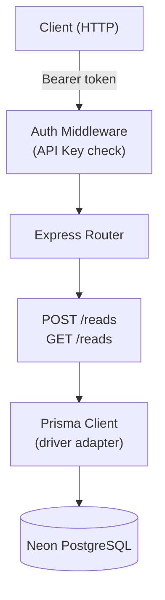

# reading-tracker-web

A simple REST API to track reading URLs. Built with Express, Prisma, and Neon PostgreSQL. Deployed on Vercel.

## Architecture



## Base URL

```
https://api.reading-tracker.jonarthurito.tech
```

## Authentication

All endpoints require a Bearer token in the `Authorization` header.

```
Authorization: Bearer <API_KEY>
```

## Endpoints

### `GET /reads`

Returns all saved reads.

**Response `200`**
```json
[
  {
    "id": 1,
    "url": "https://example.com",
    "notes": "great read",
    "createdAt": "2026-05-21T00:00:00.000Z"
  }
]
```

---

### `POST /reads`

Saves a new read. If the URL already exists, it is deleted (toggle behavior).

**Request body**
```json
{
  "url": "https://example.com",
  "notes": "optional notes"
}
```

**Response `201`** — created
```json
{
  "id": 1,
  "url": "https://example.com",
  "notes": "optional notes",
  "createdAt": "2026-05-21T00:00:00.000Z"
}
```

**Response `204`** — deleted (URL already existed)

---

## Environment Variables

| Variable       | Description                        |
|----------------|------------------------------------|
| `DATABASE_URL` | Neon PostgreSQL connection string  |
| `API_KEY`      | Bearer token for auth              |

## Local Development

```bash
npm install
cp .env.example .env  # fill in DATABASE_URL and API_KEY
npm start
```

## Deployment

Deployed on Vercel with auto-deploy from the `main` branch. Database hosted on Neon (Singapore region).
