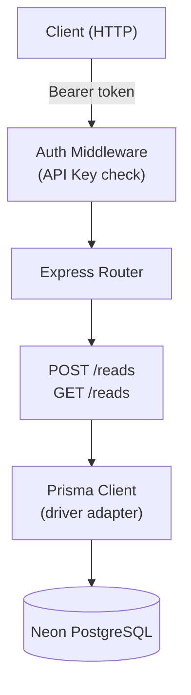

> **Deployment status:** Database live on Neon. Web service not yet deployed (pending Render setup).

```mermaid
graph TD
    Client["Client (HTTP)"]
    Auth["Auth Middleware\n(API Key check)"]
    Router["Express Router"]
    ReadsRoute["POST /reads\nGET /reads"]
    Prisma["Prisma Client\n(driver adapter)"]
    Neon[("Neon PostgreSQL")]

    Client -->|"Bearer token"| Auth
    Auth --> Router
    Router --> ReadsRoute
    ReadsRoute --> Prisma
    Prisma --> Neon
```
